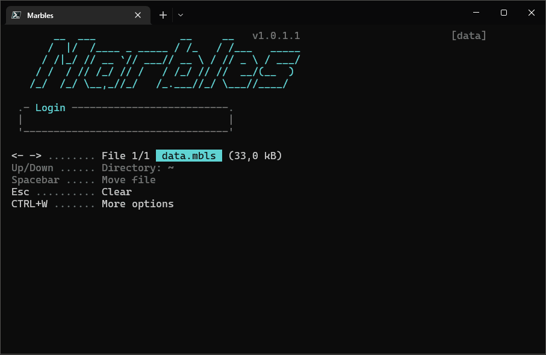

# Marbles
A lightweight cross-platform text mode application for taking notes with encryption in any terminal application on Windows and Linux.

Click the **Play** button in the upper right corner of the image to start the GIF animation.

## About Marbles
Marbles provides a simple and intuitive interface for creating, editing, searching, copying, arranging, importing, exporting and deleting notes. Notes are stored as a searchable collection of entries contained in a single encrypted file for easy portability. Multiple files can be created and managed from within the program itself. Marbles will handle large text documents and data files with thousands of notes. Plug Marbles into any Windows or Linux system and access your secure data in a 1-to-1 experience across platforms in your preferred terminal.

## Specifications
- Supported platforms: Windows and Linux
- Requirements: .NET 6
- Distribution: Cross-platform binaries
- Application type: Text mode
- Box drawing: ASCII
- Console I/O encoding: UTF-8
- Date/time format: ISO 8601
- File encryption: AES-256
- Code signing: SHA-256
- Software license: MIT

## Tools used
- Programming language: C# 10
- Programming environment: JetBrains Rider

Marbles is a pure ASCII text mode application (as in standard 128-char ASCII. No extended ASCII or ANSI char sets used). This makes Marbles compatible with all standard monospaced fonts, regardless of platform. You can either run it with the supplied Conhost executable (on Windows) or use your favorite terminal to run the Marbles.dll binary.

## Guides/getting started
- [Installation](Guide-to-installation.md)
- [Login menu](Guide-to-login-menu.md)
- [Main menu](Guide-to-main-menu.md)
- [Editor](Guide-to-editor.md)
