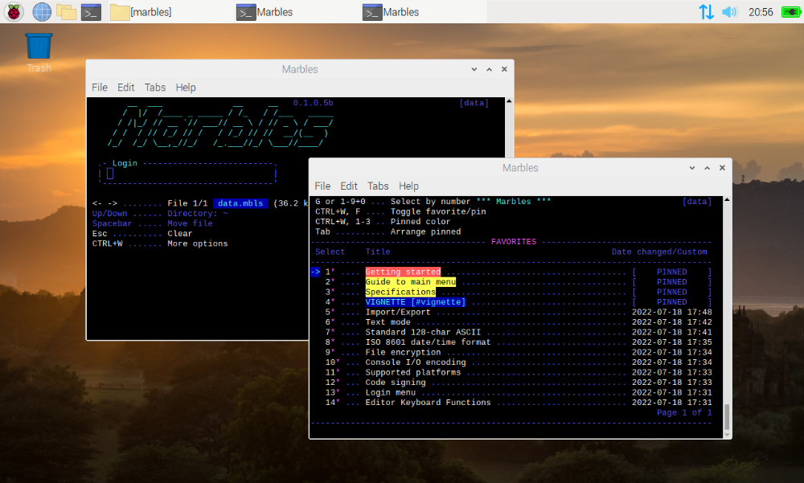

# Marbles
A lightweight cross-platform text mode application for taking notes with encryption in any terminal application on Windows and Linux.

## About Marbles
Marbles provides a simple and intuitive interface for creating, editing, searching, copying, arranging, importing, exporting and deleting notes. Notes are stored as a searchable collection of entries contained in a single encrypted file for easy portability. Multiple files can be created and managed from within the program itself. Marbles will handle large text documents and data files with thousands of notes. Plug Marbles into any Windows or Linux system and access your secure data in a 1-to-1 experience across platforms in your preferred terminal.

## Specifications
- Supported platforms: Windows and Linux
- Requirements: .NET 6
- Distribution: Cross-platform binaries
- Application type: Text mode
- Box drawing: ASCII
- Console I/O encoding: UTF-8
- Date/time format: ISO 8601
- File encryption: AES-256
- Code signing: SHA-256
- Software license: MIT

## Tools used
- Programming language: C# 10
- Programming environment: JetBrains Rider

Marbles is a pure ASCII text mode application (as in _standard 128-char ASCII_. No extended ASCII or ANSI char sets used). This makes Marbles compatible with all standard monospaced fonts, regardless of the supported platform. You can either use your favorite terminal emulator or use the supplied Conhost executable supplied with the download for Windows (view the [installation guide](Guide-to-installation.md) for more info).

Marbles relies on the .NET framework intrinsic distinctions between the different platforms and therefore has no OS-specific logic built into the source. I chose this approach to make it as clean as possible to maintain. This still presented enough options to program the text editor logic I had on my wish list for this application, although it won't match the editor capabilities of VIM etc. -that was never the goal. You can review the editor options [here](Guide-to-editor.md).

## Guides/getting started
- [Installation](Guide-to-installation.md)
- [Login menu](Guide-to-login-menu.md)
- [Main menu](Guide-to-main-menu.md)
- [Editor](Guide-to-editor.md)
- [Migrating from _AHOY!_ to Marbles](Guide-to-installation.md)
- [PowerShell scripting tips (Optional)](Guide-to-windows-terminal-crt.md)

## Gallery

Marbles in Windows Terminal on Windows 11:

Marbles in QTerminal on Lubuntu (lightweight Linux distribution based on Ubuntu):

Marbles in LXTerminal on Raspberry Pi (Debian-based Linux distribution):

Marbles in Windows Terminal with CRT mod:

Multiple instances of Marbles in split Windows Terminal with CRT mod:

### Windows Terminal CRT mod:

- [Guide to installing the Windows Terminal CRT mod](Guide-to-windows-terminal-crt.md)
